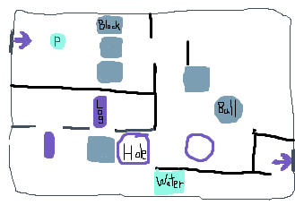
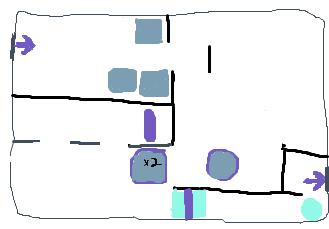

# Block Pusher
## High Concept
Solve puzzles by pushing blocks to create a path for you to walk to the exit and to the next room
________________________________________
## Genre
Top-down Puzzle game, focused on block-pushing puzzles you may find in other top-down games like The Legend of Zelda or Pokemon.
________________________________________
## Platform
Mainly Desktop, but Mobile-friendly controls
________________________________________
## Story
The player is trying to escape a temple ruins, which has fallen apart to the point where many rocks and debris surround each level, which the player must push to get around. The mood is of curiosity and possible mystery, and the game is driven by the paths you must travel to get from door to door. The player will be trying to push objects to reach one side of the room from the other so they can exit.
________________________________________
## Aesthetics
It will be styled off a cartoonish temple, with simple looping background noises and sounds for pushing objects around.
________________________________________
## Gameplay
Basic 4-directional movement around the room, in one block intervals. [Desktop: Arrows/WASD, Mobile: tap arrow overlay]

Interaction with blocks (and eventually other objects) to push them one ‘tile’ in the direction you’re facing. [Desktop: Space/Enter, Mobile: tap Center of arrow overlay]

Resetting the room if you mess up so you can retry. [Desktop: R key, Mobile: Tap Reset button]

On-screen tutorial image shown at very start of game, with a slightly modified tutorial image below/above the game itself that replaces for mobile/desktop. (or both shown at once if replacing seems difficult).

The player will learn to push blocks to reach the goal, with eventually some different pushable objects, spheres will roll as far as they can to a wall, cylinders roll one way and push the other, logs or wood float on water tiles, while others sink, or tile differences like water, previously mentioned, or ice, where all things slide to the end of, including the player. On-screen tutorials will introduce each of these.
________________________________________
## Screenshots
   
   
________________________________________
## About the Developer
Fisher Meddaugh, Game Design & Development major at RIT, Sophomore.
Interests/Skills: Programming, art/design, game music/sound, Photoshop, Illustrator, Maya, Unity, Visual Studio.

